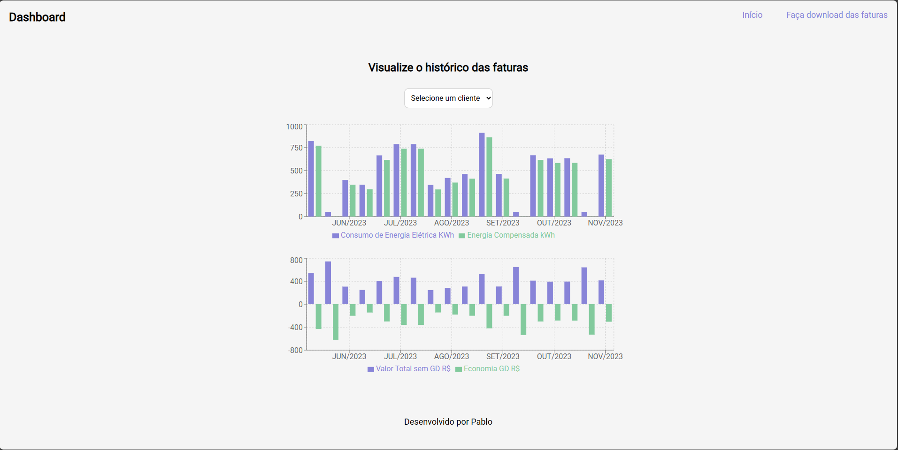

# EnergiDash

This project consists of an intuitive dashboard for viewing electricity bills, providing a simplified and informative experience for users. Furthermore, it includes a functionality that allows you to easily and quickly download the desired invoices.

# Features

## Graphical View
The dashboard offers interactive graphs that present detailed information about energy consumption over time. Users can easily identify patterns, spikes and trends, providing a clear visual understanding of their consumption patterns.

## Download Invoices
A dedicated page allows users to download their electricity bills with ease. They can select the desired invoice, view a preview and download it in PDF format. This provides convenience and quick access to necessary documents.

# How to run it 

- git clone "url" or download zip
- open folder with VS Code or another IDE
- open a terminal and run the following: 
- `npm install` and `npm run dev` 
- for tests: `npm run test`

# Screenshots

# Techs and libs

- Vite
- React
- Typescript
- Vitest
- Styled-Components
- React-Query
- Recharts 

